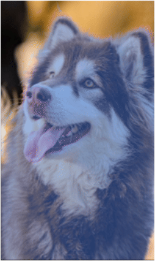
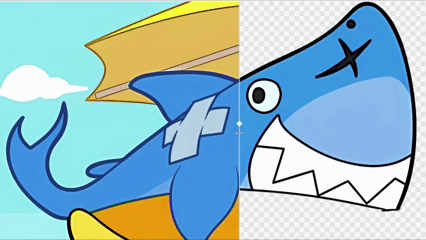
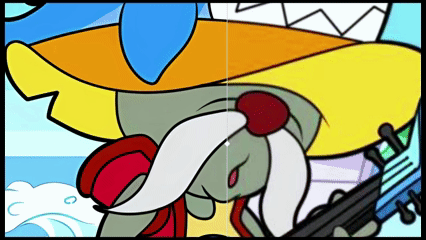
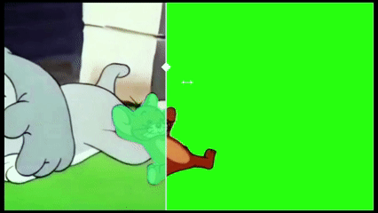

# 🎬 PexMat Studio


<details open>
<summary><b>🇬🇧 English</b></summary>

**PexMat Studio** is an open‑source audio, video, and image processing workstation.  
It deeply integrates state‑of‑the‑art AI vision models, providing a zero‑threshold, one‑stop workflow from **hair‑level intelligent matting**, **video object selection, tracking & segmentation**, and **lossless upscaling & enhancement** to **infinite‑layer creative compositing**.

<div style="display: flex; flex-direction: column; gap: 20px;">
  <!-- Row 1: two "Matting" GIFs -->
  <div style="display: flex; gap: 20px; justify-content: center;">
    <div style="text-align: center;">
      <div style="margin-bottom: 8px; font-weight: bold;">Matting</div>
      
    </div>
    <div style="text-align: center;">
      <div style="margin-bottom: 8px; font-weight: bold;">Matting</div>
      
    </div>
  </div>
  <!-- Row 2: left "Enhancement", right "Video Matting" -->
  <div style="display: flex; gap: 20px; justify-content: center;">
    <div style="text-align: center;">
      <div style="margin-bottom: 8px; font-weight: bold;">Enhancement</div>
      
    </div>
    <div style="text-align: center;">
      <div style="margin-bottom: 8px; font-weight: bold;">Video Matting</div>
      
    </div>
  </div>
</div>

---

## ✨ Core Features

*   🚀 **Intelligent Tracking Matting for Video & Image**
    *   Powered by the SAM 2 engine, it supports point/prompt and box interactions, enabling one‑click tracking of dynamic objects in video frames.
*   💇‍♀️ **Hair‑level Edge Refinement**
    *   In the matting interface, hold `Alt` to preview the mask. The interactive algorithm is **MatAnyone2**; one‑click matting refinement uses **MEMatte** and **BiRefNet**. It delivers adaptive smoothing, feathering, and detail shrinking/expanding for hair, semi‑transparent objects, and fine edges – no more harsh borders.
*   🔍 **AI Lossless Upscaling (Enhancement)**
    *   Integrated with the **Real‑ESRGAN** algorithm, it supports 2×/3×/4× lossless upscaling. Built‑in anime/general models and an intelligent GPU memory‑tiling strategy ensure smooth performance.
*   🎨 **All‑round Creative Workshop (Stitching Canvas)**
    *   Supports independent layer management for multiple assets – scale, rotate, opacity blending. Hold `Ctrl` to multi‑select assets.
    *   Original audio track extraction, multi‑clip video mixing, single‑clip trimming, background music attachment, and volume adjustment. Video matting up to **10 seconds** is supported.
*   ⚡ **Cutting‑edge Modern UI Experience**
    *   Built with **PySide6**, offering a sleek, responsive, and intuitive interface.

---

## 🧠 Core AI Engines (Powered By)

This software utilizes the following top‑tier open‑source AI models and frameworks. Huge thanks to the open‑source community!

*   **[SAM 2 (Segment Anything 2)](https://github.com/facebookresearch/segment-anything-2)**  
    *   *Purpose:* Core interactive image segmentation and temporal object tracking in videos.
*   **[Real‑ESRGAN](https://github.com/xinntao/Real-ESRGAN)**  
    *   *Purpose:* High‑resolution upscaling and image quality enhancement.
*   **[MatAnyone2](https://github.com/pq-yang/MatAnyone2)** (the hair‑level engine referenced in the code)  
    *   *Purpose:* Handling complex alpha mattes for hair‑level fine matting.
*   **[YOLO26](https://github.com/zycer/yolo26_rknn_ultralytics)**  
    *   *Purpose:* Determines whether the target is a person.
*   **[MEMatte](https://github.com/linyiheng123/MEMatte)**  
    *   *Purpose:* Used in one‑click matting for portrait hair refinement.
*   **[BiRefNet](https://github.com/ZhengPeng7/BiRefNet)**  
    *   *Purpose:* One‑click matting for non‑portrait subjects.

---

## 🛠️ Quick Start

### Requirements
*   Python 3.10 or higher  
*   Image matting is CPU‑friendly  
*   For the best experience, an NVIDIA GPU with CUDA support (RTX 4060 or above) is recommended. 12 GB of RAM or more is suggested for 1080p and higher.

### Running the Software

**Method 1: Use the portable version (Recommended)**

If you prefer not to set up an environment, simply download our pre‑packaged Windows version, extract it, and double‑click the executable:

[👉 Download PexMat-Studio]()

**Method 2: Run from source**

#### Install dependencies
```bash
git clone https://github.com/your-username/PexMat-Studio-Pro.git
cd PexMat-Studio
```
Create a virtual environment:
```bash
conda create -n PexMat python=3.10
```
Install PyTorch separately (example):
```bash
pip install torch==2.5.1+cu121 torchvision==0.20.1+cu121 torchaudio==2.5.1+cu121 --index-url https://download.pytorch.org/whl/cu121
```
Configure the system C++ environment: install Visual Studio Build Tools (select “Desktop development with C++”) and download the official [detectron2](https://github.com/facebookresearch/detectron2) repository locally.
```bash
cd detectron2
python -m pip install -e . --no-build-isolation
```
Install the remaining libraries:
```bash
pip install -r requirements.txt
```
Start the application:
```bash
python main.py
```
Note: The first time you run from source, the necessary pre‑trained model weights must be downloaded and placed in the checkpoints directory. You can find them on their respective GitHub repositories, or download our consolidated weight package:
[📦 Download Model Weights Package]()

### Packaging the Software
If you modify the source code and wish to package the PySide6 application yourself, run the following in the project root directory:
```bash
python ImageVideoToolbox.spec
```

### 📜 License
The code of this project is open‑sourced under the Apache License 2.0. You are free to use, modify, and distribute the code, even for commercial purposes, provided that the original license notice is included.

### ⚠️ Important Notice:
The third‑party AI models integrated in this project may be subject to their own open‑source licenses. If you intend to use this project for commercial purposes, please verify and comply with the respective licenses of the original model authors.

</details>
<details>
<summary><b>🇨🇳 中文</b></summary>

**PexMat Studio** 是一款开源的音视频与图像综合处理工作台。
本项目将目前AI视觉模型深度结合，提供从**发丝级智能抠图**、**视频对象选择追踪分割**、**画质超分增强**到**无限图层创意拼接**的一站式零门槛工作流。

<div style="display: flex; flex-direction: column; gap: 20px;">
  <!-- 第一行：两个“抠图” GIF -->
  <div style="display: flex; gap: 20px; justify-content: center;">
    <div style="text-align: center;">
      <div style="margin-bottom: 8px; font-weight: bold;">抠图</div>
      
    </div>
    <div style="text-align: center;">
      <div style="margin-bottom: 8px; font-weight: bold;">抠图</div>
      
    </div>
  </div>
  <!-- 第二行：左侧“增强”，右侧“视频抠图” -->
  <div style="display: flex; gap: 20px; justify-content: center;">
    <div style="text-align: center;">
      <div style="margin-bottom: 8px; font-weight: bold;">增强</div>
      
    </div>
    <div style="text-align: center;">
      <div style="margin-bottom: 8px; font-weight: bold;">视频抠图</div>
      
    </div>
  </div>
</div>


---

## ✨ 核心特性 (Core Features)

*   🚀 **视频/图像智能追踪抠图**
    *   基于 SAM 2 引擎，支持“点/框”交互，一键追踪视频画面中的动态对象。
*   💇‍♀️ **发丝级边缘精雕**
    *   抠图界面按住Alt可以预览蒙版，交互式算法为MatAnyone2，一键抠图精修算法为MEMatte和BiRefNet针对毛发、半透明物体的边缘，提供自适应的平滑、羽化与细节收缩扩张，告别生硬边缘。
*   🔍 **AI **无损画质增强 (Upscaling)**
    *   集成 Real-ESRGAN 算法，支持 2x/3x/4x 无损放大，内置动漫/通用模型与智能显存分块策略。
*   🎨 **全能创意工坊 (Stitching Canvas)**
    *   支持多素材独立图层管理、缩放、旋转、透明度混合，按住ctrl键可以多选素材。
    *   支持原声音轨提取、多段视频混合、单片段剪辑以及BGM挂载与音量调整，提供最长10秒的视频抠图功能。
*   ⚡ **极致的现代化 UI 体验**
    *   基于PySide6 打造。**

---

## 🧠 核心 AI 驱动库 (Powered By)

本软件使用以下顶尖开源 AI 模型与框架，向伟大的开源社区致敬：

*   **[SAM 2 (Segment Anything 2)](https://github.com/facebookresearch/segment-anything-2)**
    *   *用途*: 核心交互式图像分割与视频时序对象追踪。
*   **[Real-ESRGAN](https://github.com/xinntao/Real-ESRGAN)** 
    *   *用途*: 图像的高清分辨率放大与画质增强。
*   **[MatAnyone2](https://github.com/pq-yang/MatAnyone2)** (代码中引用的发丝级引擎)
    *   *用途*: 处理复杂的 Alpha 遮罩，实现发丝级精细抠图。
*   **[YOLO26](https://github.com/zycer/yolo26_rknn_ultralytics)**
*   *   *用途*：定位目标是否是人
*   **[MEMate](https://github.com/linyiheng123/MEMatte)**
*   *   *用途*：用于一键抠图功能的人像发丝抠图
*   **[BiRefNet](https://github.com/ZhengPeng7/BiRefNet)**
*   *   *用途*：用于非人像的一键抠图

---

## 🛠️ 快速开始 (Quick Start)

### 环境要求
*   Python 3.10 或更高版本
*   图像抠图cpu友好支持
*   推荐使用具备 CUDA 加速的 Nvidia 显卡（RTX4060以上）以获得最佳体验，1080p以上推荐内存12G。


### 运行软件
*方法一：直接使用免安装版（推荐）*

如果你不想配置环境，可以直接下载我们windows版本已经打包好的软件，解压双击exe即用：

[👉 下载 PexMat-Studio]()

*方法二：通过源码运行*

### 安装依赖
```bash
git clone https://github.com/your-username/PexMat-Studio-Pro.git
cd PexMat-Studio
```
创建虚拟环境
```bash
conda create -n PexMat python=3.10
```
单独安装torch，示例：
```bash
pip install torch==2.5.1+cu121 torchvision==0.20.1+cu121 torchaudio==2.5.1+cu121 --index-url https://download.pytorch.org/whl/cu121
```
配置系统的c++，安装 Visual Studio 生成工具（勾选 C++ 桌面开发）并下载官方的[detectron2](https://github.com/facebookresearch/detectron2)到本地
```bash
cd detectron2
python -m pip install -e . --no-build-isolation
```
导入库
```bash
pip install -r requirements.txt
```
运行以下命令启动：
```bash
python main.py
```
注： 首次源码运行需要下载必要的预训练模型权重，并放入 checkpoints 目录。你可以到各自的 GitHub 仓库寻找，或者直接下载我们整理好的完整权重包：

[📦 下载模型权重包](https://这里替换成你的真实链接地址.com)

### 打包软件
如果你修改了源码并希望自行打包 PySide6 应用，请在项目主目录下运行：
```bash
python ImageVideoToolbox.spec
```

### 📜 开源协议 (License)
**本项目代码采用 Apache License 2.0 协议开源。你可以自由地使用、修改和分发代码，甚至用于商业用途，但需附带原始许可声明。**

### ⚠️ 重要声明：
***本项目内集成的第三方 AI 模型，可能受其各自开源协议的约束。若将本项目用于商业用途，请务必自行核实并遵守对应模型原始作者的 License。***

</details>